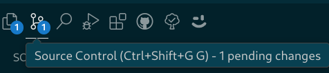
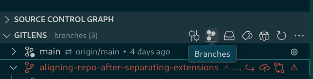
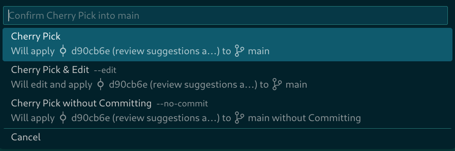

# Editor and extensions configuration

## How do I change VSCode configuration?

To change VSCode configuration, you have two options:

1. Use the graphical `Settings` application.This way you can configure VSCode by
specifying options in a user-friendly environment. To open the `Settings`
application, press `CTRL+,`. The application offers descriptions of the options
as well as default values. For example, to modify DAPS related configuration,
select `Extensions > DAPS` in the left panel.

1. Open the `settings.json` file and modify the configuration there. This way
you can modify the configuration directly by typing the specific configuration
options in the JSON format. To open user settings, press `CTRL+SHIFT+P` and type
`json`. Select `Preferences: Open User Settings (JSON)`.

## I can no longer see `Peek into` and `Open in a new tab` links above references to sections and modules, why?

Since vscode-daps 0.7.21, the codelens feature is disabled by default. To enable
it, open the `Settings` application by pressing `CTRL+,`and search for `daps
codelens`. Specify `both` as the value to the `Show Assembly Codelens` and `Show
Xref Codelens` options.

TIP: DAPS codelens are now activated on the 'save' event instead of any editor
'change' to speed VSCode up. Therefore, you need to save the active editor with
`CTRL+S` to update the codelens links.

## Images in the Docbook HTML preview are not shown, why?
The Docbook preview screen is activated by the VSCode's `DAPS: Preview document`
command. To view images correctly, you must specify the path to the directory
where images are stored. The path must be relative to where the XML documents
are located. For example, if all images are stored in the `images` subdirectory
of a repository as in the case of https://github.com/SUSE/doc-modular, the
following configuration in the `settings.json` file will solve the issue:
```
"daps.docPreviewImgPath": "../images/"
```

# Editing experience

## How do I replace multiple occurrences of a string at once?

In VScode it is possible to replace multiple occurrences of a string
simultaneously as you type. It is different from the traditional 'search and
replace' procedure in that the strings are replaced in parallel.

1. Select the string that you want to replace with a mouse. All the string
occurrences will be highlighted throughout the document.

    

1. Press `CTRL+F2` or left-click the highlighted string and select `Change All
Occurrences`. All string occurrences get selected and a blinking cursor appears
next to all matching strings.

1. Start typing or paste the replacement string. All the matched strings get
erased and replaced with the new content.

# Git related

## How do I cherry-pick in VSCode?

NOTE: To preform a user-friendly git cherry-pick from one git branch to another
using VSCode, you must have the GitLens extension installed.

1. In the left panel, switch to the `Source Control` view by clicking the
corresponding icon or pressing the `CTRL+SHIFT+G G` combo.

    

1. Unfold the `GITLENS` tab from the accordion in the left panel and activate
the `branches` view.

    

1. Select and unfold the branch whose commit you want to cherry-pick to the
current branch.

1. Right-click the commit message you want to cherry-pick and select `Cherry
Pick Commit`.

1. From the top center drop-down list, select the action you want to perform.

    