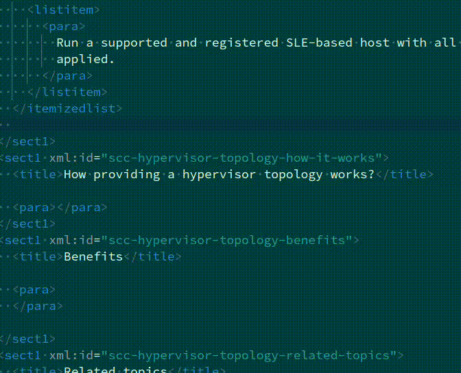

# docbook-snippets README

## Features

The DocBook Snippets extension includes templates of both simple and complex DocBook structures.
You can populate the templates by pressing by the initial DocBook markup letters. For example,
pressing `li` results in `<listitem>insert content</listitem>`. The list of templates is not complete and will be extended with future releases.

## Requirements

This extension has no dependencies.

## Extension Settings

This extension does not provide any settings yet.

## Known Issues

No issues yet.

## Release Notes

The extension was updated at the following points:

### 0.0.1

Initial release.
